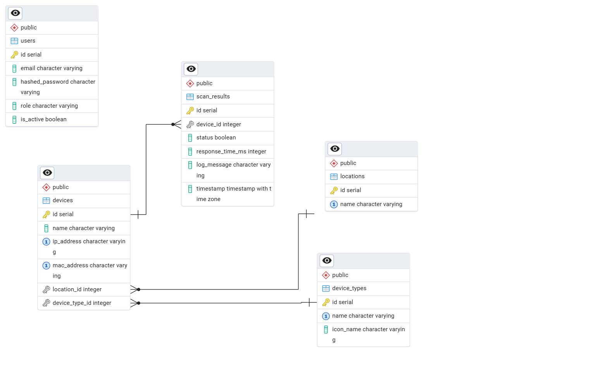

# 🌐 Network Admin Panel

**Network Admin Panel** is a web application designed for monitoring and managing devices in a local network.
It allows administrators to maintain an inventory of connected hosts, track their IP addresses and statuses, and perform basic network checks such as ping tests.

The application is containerized using Docker and provides a web dashboard for visualizing network data stored in a PostgreSQL database.

---

## 🛠 Tech Stack

* **Infrastructure:** Docker & Docker Compose
* **Backend:** Python (FastAPI) + SQLAlchemy
* **Database:** PostgreSQL
* **Frontend:** React, HTML, CSS (Planned)

---

## 🗄 Database Architecture

The system uses a relational database to manage users, devices, locations, and scan logs. Below is the Entity Relationship Diagram (ERD) representing the database schema:



### Key Modules:
* **Inventory:** Management of Devices (`devices`) and their Types (`device_types`).
* **Locations:** Physical mapping of devices (`locations`).
* **Monitoring:** Historical logs of network scans (`scan_results`).
* **Security:** User authentication (`users`).

---

## 🚀 Getting Started

To run the application locally:

1.  **Clone the repository**
2.  **Build and start containers:**
    ```bash
    docker-compose up --build
    ```
3.  **Access the application:**
    * Backend API Docs: http://localhost:8000/docs
    * Database Admin (PgAdmin): http://localhost:5050