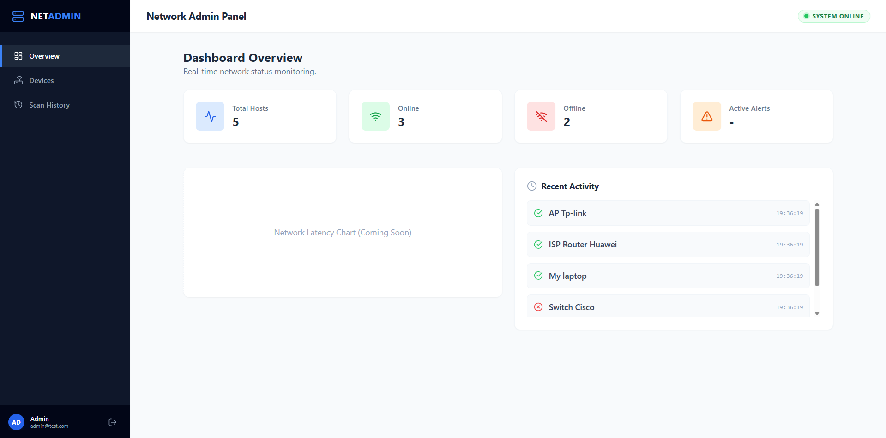
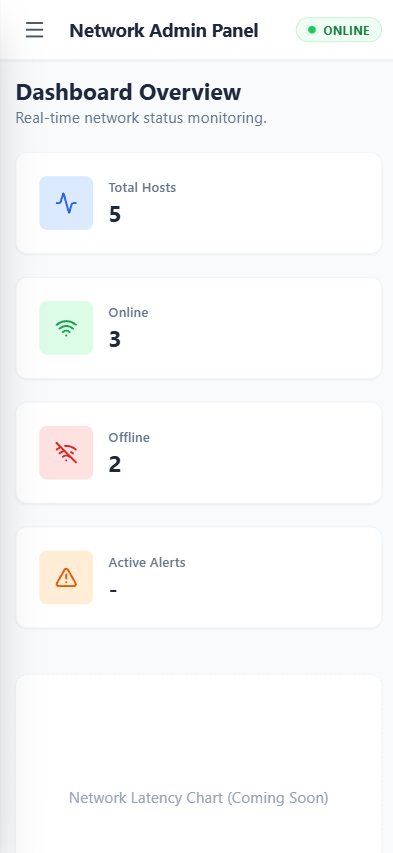
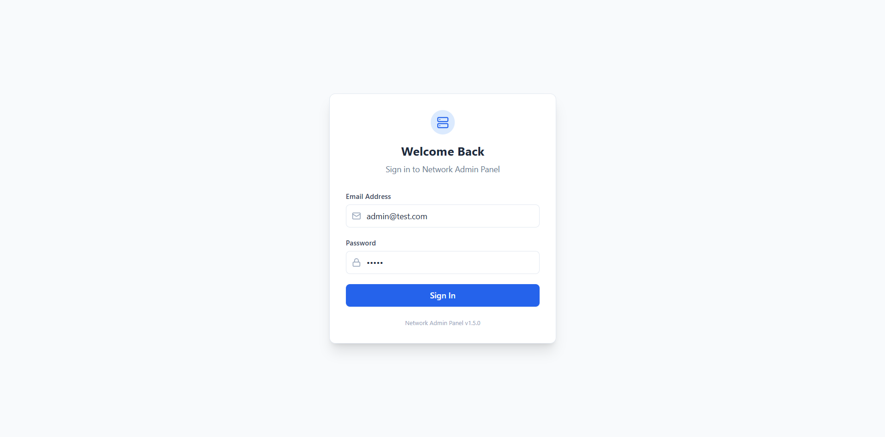
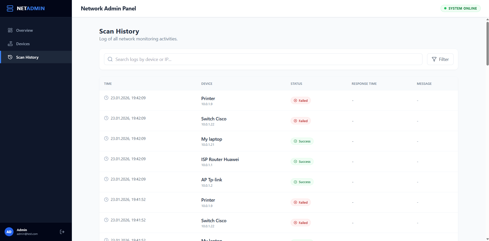
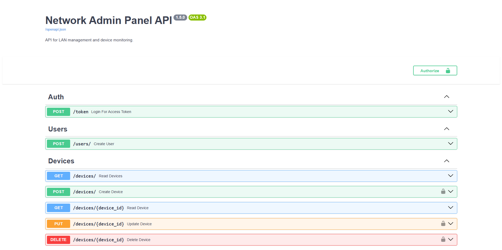

# 🌐 Network Admin Panel

**Network Admin Panel** is a modern, full-stack web application designed for real-time monitoring and management of local network devices. It allows administrators to maintain a detailed inventory of hosts, track their availability (Online/Offline status), and view historical connectivity data.

The system features a **secure REST API**, a **responsive React frontend**, and an **asynchronous background worker** for non-blocking network scanning.

---

## ✨ Key Features

* **📊 Interactive Dashboard:** Real-time overview of network health and device statistics.
* **🔐 Secure Authentication:** JWT-based login system with role management (Admin/User).
* **🔎 Device Inventory:** Full CRUD (Create, Read, Update, Delete) operations for network devices.
* **⚡ Async Network Scanning:** Background Python worker (`asyncio`) monitoring device status every 60 seconds without freezing the API.
* **📱 Responsive Design:** Fully optimized UI for both desktop and mobile devices.
* **📜 Scan History:** Detailed logs of connectivity checks stored in PostgreSQL.

---

## 🛠 Tech Stack & Justification

The project was built using modern, industry-standard technologies to ensure performance, scalability, and maintainability.

* **Backend: Python (FastAPI)**
    * *Why?* Chosen for its incredible speed, automatic OpenAPI (Swagger) documentation generation, and native support for asynchronous programming (`async/await`), which is crucial for network I/O operations.
* **Frontend: React + Tailwind CSS**
    * *Why?* React provides a component-based architecture for a dynamic UI, while Tailwind allows for rapid, responsive styling directly in the markup.
* **Database: PostgreSQL + SQLAlchemy**
    * *Why?* A robust, ACID-compliant relational database ensures data integrity for critical device logs and user data.
* **Infrastructure: Docker**
    * *Why?* Ensures consistent environments across development and production, solving the "it works on my machine" problem.

---

## 📸 Screenshots

### 🖥️ Dashboard & Overview
A central hub for network statistics.



### 📱 Mobile Responsiveness
The application is fully accessible on mobile devices.

<p align="left">
  
   
</p>

### ⚙️ Device Management
Inventory management with status indicators.


### 🔐 Security & History
Secure login screen and detailed scan logs.

<p align="left">
  
   
</p>

### 📖 API Documentation (Swagger UI)
Auto-generated documentation available at `/docs`.



---

## 🗄 Database Architecture

The system uses a relational database normalized to 3NF. Below is the Entity Relationship Diagram (ERD):


* **Users:** Stores credentials and roles.
* **Devices:** Main inventory table linking to Locations and Types.
* **ScanResults:** Stores historical ping data (One-to-Many relationship with Devices).

---

## 🚀 Getting Started

To run the application locally, you need **Docker** and **Python 3.10+**.

### Option A: Manual Setup (Recommended for Development)

Since the project uses a background worker, you need to run three components:

1.  **Database:**
    ```bash
    docker run --name network-db -e POSTGRES_USER=admin -e POSTGRES_PASSWORD=admin -e POSTGRES_DB=network_db -p 5432:5432 -d postgres
    ```

2.  **Backend API (Terminal 1):**
    ```bash
    cd backend
    pip install -r requirements.txt
    uvicorn main:app --reload
    ```
    *Access API Docs at: http://localhost:8000/docs*

3.  **Background Worker (Terminal 2):**
    This service runs the infinite scanning loop.
    ```bash
    cd backend
    python worker.py
    ```

4.  **Frontend (Terminal 3):**
    ```bash
    cd frontend
    npm install
    npm run dev
    ```
    *Access App at: http://localhost:5173*

---